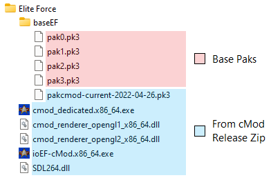

# Installation

## Method 1 - Existing Installation

Download the [cMod release](https://github.com/Chomenor/ioef-cmod/releases), extract it into your Elite Force directory, and run the included application. In most cases your existing EF client will continue to work without conflicts, but if you want to be extra safe, make a backup of your EF directory before installing cMod.

## Method 2 - TLO Installer (Windows Only)

A simple installation method is to use the installer from The Last Outpost. This includes a working version of cMod and all necessary files. However, the installer is for Windows only, and the version of cMod included may not always be the latest.

To use this method, simply visit [holomat.ch](https://holomat.ch) and select the Windows download.

## Method 3 - TLO Standalone Version

This method creates a "portable" installation for any supported operating system.

- Visit [holomat.ch](https://holomat.ch) and select the Linux download. Don't worry if you aren't actually using Linux, as the necessary files work for all operating systems.
- Extract the downloaded archive to an empty folder on your system. If you are unable to open the .7z file, you may need to install [7-zip](https://www.7-zip.org).
- Download the [cMod release](https://github.com/Chomenor/ioef-cmod/releases) corresponding to your operating system. Extract it to the same folder.
- Run the included application.

## Method 4 - Good Old Games (Windows Only)

If you have purchased Elite Force through Good Old Games, you can run cMod using these steps:

- Install Elite Force normally through Good Old Games (either via GOG Galaxy or the standalone installer).
- Create an empty folder anywhere on your system.
- Download the [cMod release](https://github.com/Chomenor/ioef-cmod/releases) for Windows. Extract it to that folder.
- Run the included application.

It is also fine to extract cMod directly to the install directory, but the above method may be simpler.

## Method 5 - Clean Install

- Create an empty folder anywhere on your system.
- Download the [cMod release](https://github.com/Chomenor/ioef-cmod/releases) corresponding to your operating system. Extract it to that folder.
- Create a folder named "baseEF" inside that folder (if it doesn't already exist). Copy the base paks (pak0 - pak3) to that folder. If you don't have these paks available, use one of the other installation methods first.

A minimal install for Windows should look something like this:



# Linux Notes

The Linux releases require the SDL 2 library to be installed. On Ubuntu 22 you can use this command:

```
sudo apt install libsdl2-2.0-0
```

Depending on the Linux distribution, the exact command to install this package may vary, and there may be other packages required as well. The package requirements for cMod should generally be the same as for [ioquake3](https://ioquake3.org).
