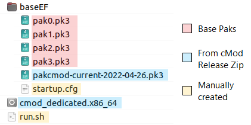

# Server Readme

There are currently two approaches to running servers with cMod.

- New server template: Has more advanced features and better setup instructions, but is still being developed and currently only supports the original game modes and UAM (Gladiator). I recommend trying this first if you don't need to use other mods. Available at [https://github.com/Chomenor/cmod-server-template](https://github.com/Chomenor/cmod-server-template).
- Traditional server config: More limited functionality, but generally supports the same mods and configs as the original game.

The remainder of this document covers the traditional method of running servers using this engine. It covers features and configuration aspects that may be specific to cMod, but is not a comprehensive guide to running servers.

## Directory Layout

A minimal server environment looks something like this:



Example startup.cfg:
```
map ctf_voy1
```

Example run.sh (run this to start the server):
```
./cmod_dedicated.x86_64 +exec startup
```

### Server-Side Mods

If you have a mod that is entirely server-side, such as Gladiator, EFAdmin, and many other mods, or a custom mod that you compiled yourself, then follow these steps for loading the mod.

- Create a directory called "servercfg" alongside baseEF in your server install directory. This directory is handled specially by cMod so that its contents override baseEF, similar to "basemod" on the client.
- If your mod consists of one or more pk3 files, simply place them in the servercfg folder.
- If your mod consists of a qagame.qvm file, place it in the following location: "servercfg/vm/qagame.qvm"
- Don't set any fs_game setting on the command line.

Although the fs_game method below should work as well, the above approach is preferred for server-side mods because it avoids some unwanted side effects on clients that can be caused by changing fs_game.

### Client-Side Mods

If you have a client-side mod that depends on certain pk3s being loaded on the client, use the standard method of mod loading, which involves setting fs_game.

- Extract the mod so that it is saved to a directory alongside baseEF in your server install directory.
- Load the mod by including `+set fs_game [mod-directory]` in the server startup command.

If your server supports downloads (sv_allowDownload enabled) all pk3s in the mod directory will be included by default in the list of pk3s to be downloaded to clients.

### Directory Types

The different types of mod directories can be confusing. Here is a list of the directory types supported in cMod servers, to help clarify the differences and how they can be used together.

#### servercfg

- For *server-side* mods and content.
- Files are not downloaded to client at all by default.
- Has maximum priority on the server.
- Directory is named `servercfg` by default, but can be changed by `fs_servercfg` cvar. For example, it could be renamed to `myservercfg` by adding `+set fs_servercfg myservercfg` to the run script.
- Multiple directories can be specified, separated by space, e.g. `+set fs_servercfg myservercfg servercfg`. The first directory specified has priority in conflicts.

#### fs_game

- For *client-side* mods and content.
- ALL pk3 files in this directory are downloaded to clients by default.
- Has medium priority on the server (higher than baseEF, lower than servercfg).
- Set by fs_game cvar, e.g. `+set fs_game mymod`. Default is not set (cvar is empty).
- Only one directory can be set at a time.

#### baseEF

- For base paks (pak0-pak3) and general content such as maps and models.
- Some files (such as the current map pk3) are downloaded to clients by default.
- Has lowest priority on the server.
- The base paks override other files within this directory, regardless of filename. Mods should be loaded using servercfg or fs_game instead.

#### basemod

- Not recommended for dedicated servers. Use servercfg or fs_game instead.

### Source Directories

It is possible to specify a particular source directory where files are stored, instead of the default (which is typically the executable location). The specified directory should contain baseEF and/or other mod directories.

```
./cmod_dedicated.x86_64 +set fs_dirs *fs_basepath +set fs_basepath /path/to/ef/directory +exec startup
```

You can also specify more than one directory. This can be useful for configurations involving more than one server instance. For example, each server may have its own config directory, and also load a common directory that contains maps and resources shared with all servers.

```
./cmod_dedicated.x86_64 +set fs_dirs *fs_basepath fs_additional +set fs_basepath /path/to/ef/directory +set fs_additional /path/to/second/directory +exec startup
```

Notes:
- The `*` before fs_basepath in specifies that it is the "write" directory, where files such as logs will be written.
- The names "fs_basepath" and "fs_additional" are arbitrary; you can replace them with any non-conflicting name. It is also possible to use more than 2 directories.

### Mod Switching

Both `fs_servercfg` and `fs_game` support being modified on a running server, which allows switching mods without disconnecting players. A change to either of these values should generally be followed immediately by a `map` command to load the new map and mod. Note this feature is currently considered experimental and may not work well with all mods.

## Server-Side Recording

This feature is used to record games on a server. The recordings are created in a specific format which stores the game from every player's perspective, and can be converted to the standard demo format for playback later.

To enable recording, set `record_auto_recording` to 1. The recording will automatically start when players connect to the server, and stop when all players have disconnected. You can also manually start and stop recording for a single game by using the "record_start" and "record_stop" commands. Records are stored as .rec files sorted by date and time under the "records" folder in the server directory.

To view the available demos that can be extracted from a certain .rec file, use the `record_scan <filename>` command, where the filename is the path to the file within the records directory. Example: `record_scan 2018-02-08/16-07-27.rec`. The output shows the client number and instance numbers. The client number is the number assigned to the client when they connected to the server. The instance numbers differentiate sessions when a client reconnected during a recording session, or one client disconnected and another client connected and was assigned the same number.

To convert the demo, use the `record_convert <filename> <clientnum> <instance>` command, with a valid client and instance as provided by the record_scan command. The output will be written to the file demos/output.efdemo under baseEF or the current mod directory.

## Admin Spectator Support

This feature allows admins to spectate players on the server without joining the server, which can be useful to monitor for cheating.

To enable this feature, set `admin_spectator_password` to a password of your choosing on the server.

To connect to the server in spectator mode, set "password" on the client to "spect_" plus the password on the server. For example if admin_spectator_password is set to "xyz" on the server, then set the password value on the client to "spect_xyz" before connecting to the server in order to enter spectator mode.
